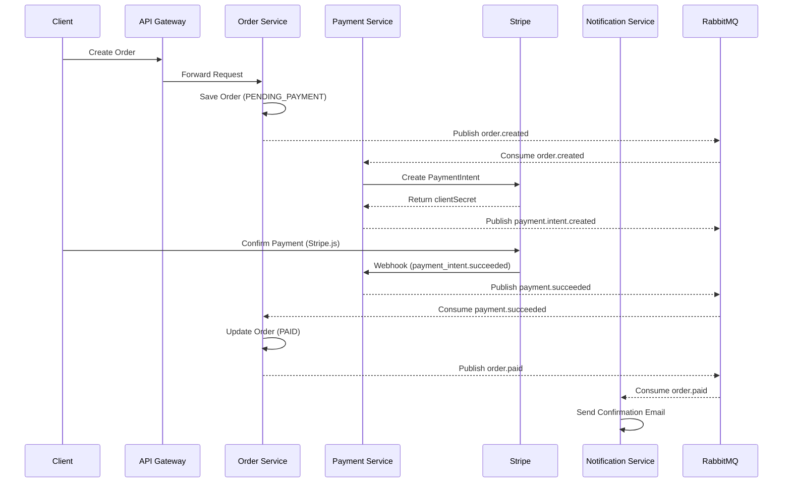

<p align="center">
  
  
  
  
  
  
  
  
</p>

<h1 align="center">🛒 Kada Mandiya</h1>

<p align="center">
  <strong>A production-grade, event-driven microservices e-commerce platform</strong>
</p>

<p align="center">
  <a href="#-features">Features</a> •
  <a href="#️-architecture">Architecture</a> •
  <a href="#-tech-stack">Tech Stack</a> •
  <a href="#-project-structure">Structure</a> •
  <a href="#-getting-started">Getting Started</a> •
  <a href="#-api-documentation">API Docs</a> •
  <a href="#-contributing">Contributing</a>
</p>

<p align="center">
  
  
  
</p>

## 📱mobile app coming soon (ReactNative)

---

## 📖 Overview

**Kada Mandiya** (කඩ මැදියේ - "In the Midst of Shops" in Sinhala) is a comprehensive, production-ready e-commerce platform built using modern microservices architecture. This project demonstrates enterprise-grade patterns including event-driven communication, domain separation, and distributed system best practices.
---

## ✨ Features

### 🏗️ Architecture & Design

- **Pure Event-Driven Architecture** - Services communicate exclusively via RabbitMQ events
- **Database per Service** - Complete data isolation with dedicated SQL Server databases
- **API Gateway Pattern** - Centralized entry point with JWT validation and request routing
- **Idempotent Consumers** - Safe event processing with duplicate detection

### 🛡️ Security

- **JWT Authentication** - Stateless, locally-verified tokens across all services
- **Stripe Webhook Verification** - Cryptographically signed payment notifications
- **Secure Password Hashing** - Industry-standard credential protection

### 💳 Payments

- **Stripe Integration** - Production-ready payment processing
- **Secure Payment Flow** - Backend-validated amounts, no client-side trust
- **Webhook Handling** - Reliable payment status updates with retry support

### 🔧 Developer Experience

- **Monorepo Structure** - Organized, scalable codebase with shared packages
- **TypeScript Throughout** - End-to-end type safety
- **Docker Compose** - One-command local development setup
- **Shared npm Packages** - Reusable code for events, auth, logging, and messaging

---

## 🏛️ Architecture

```
┌─────────────────────────────────────────────────────────────────────────────┐
│                              CLIENTS                                         │
│                         (Web / Mobile Apps)                                  │
└─────────────────────────────────┬───────────────────────────────────────────┘
                                  │
                                  ▼
┌─────────────────────────────────────────────────────────────────────────────┐
│                           API GATEWAY                                        │
│              (JWT Verification • Request Routing • Rate Limiting)           │
└─────────────────────────────────┬───────────────────────────────────────────┘
                                  │ HTTP
                                  ▼
┌─────────────────────────────────────────────────────────────────────────────┐
│                         MICROSERVICES LAYER                                  │
│  ┌──────────┐ ┌──────────┐ ┌──────────┐ ┌──────────┐ ┌──────────┐          │
│  │   Auth   │ │   User   │ │ Product  │ │  Order   │ │ Payment  │          │
│  │ Service  │ │ Service  │ │ Service  │ │ Service  │ │ Service  │          │
│  └─────┬────┘ └─────┬────┘ └─────┬────┘ └─────┬────┘ └─────┬────┘          │
│        │            │            │            │            │                 │
│  ┌──────────┐ ┌──────────┐ ┌──────────┐ ┌──────────┐ ┌──────────┐          │
│  │ auth_db  │ │ user_db  │ │product_db│ │ order_db │ │payment_db│          │
│  └──────────┘ └──────────┘ └──────────┘ └──────────┘ └──────────┘          │
│                                                                              │
│  ┌──────────┐ ┌──────────┐ ┌──────────┐ ┌──────────┐                        │
│  │  Review  │ │  Vendor  │ │   Cart   │ │  Notif   │                        │
│  │ Service  │ │ Service  │ │ Service  │ │ Service  │                        │
│  └──────────┘ └──────────┘ └──────────┘ └──────────┘                        │
└─────────────────────────────────┬───────────────────────────────────────────┘
                                  │ Events
                                  ▼
┌─────────────────────────────────────────────────────────────────────────────┐
│                            RABBITMQ                                          │
│                   (Topic Exchange: domain.events)                           │
│                                                                              │
│   Events: order.created • payment.succeeded • order.paid • review.created   │
└─────────────────────────────────────────────────────────────────────────────┘
```

### Architecture Principles

| Principle                      | Description                                               |
| ------------------------------ | --------------------------------------------------------- |
| **No Service-to-Service HTTP** | Business services communicate only via RabbitMQ events    |
| **Database per Service**       | Each service owns and manages its own database            |
| **Local JWT Verification**     | Tokens are validated locally without calling Auth service |
| **Idempotent Processing**      | All event consumers safely handle duplicate messages      |
| **Correlation Tracking**       | Every request/event carries a `correlationId` for tracing |

---

## 🛠️ Tech Stack

### Backend Services

| Technology     | Purpose                           |
| -------------- | --------------------------------- |
| **Node.js**    | Runtime environment               |
| **Express.js** | Web framework                     |
| **TypeScript** | Type-safe development             |
| **SQL Server** | Relational database (per service) |
| **RabbitMQ**   | Message broker for async events   |

### Frontend

| Technology     | Purpose                  |
| -------------- | ------------------------ |
| **Next.js**    | React framework with SSR |
| **TypeScript** | Type-safe development    |

### Payments & Infrastructure

| Technology         | Purpose                         |
| ------------------ | ------------------------------- |
| **Stripe**         | Payment processing              |
| **Docker**         | Containerization                |
| **Docker Compose** | Local development orchestration |

---

## 📁 Project Structure

```
kada_mandiya_microservice/
├── 📂 apps/                          # Client-facing applications
│   ├── 📂 api-gateway/               # Edge service (JWT, routing)
│   └── 📂 web-nextjs/                # Next.js frontend
│
├── 📂 services/                      # Business microservices
│   ├── 📂 auth-service/              # Authentication & JWT issuance
│   ├── 📂 user-service/              # User profiles & preferences
│   ├── 📂 product-service/           # Products, categories, pricing
│   ├── 📂 order-service/             # Order management & lifecycle
│   ├── 📂 payment-service/           # Stripe integration & webhooks
│   ├── 📂 cart-service/              # Shopping cart management
│   ├── 📂 review-service/            # Product reviews & ratings
│   ├── 📂 vendor-service/            # Vendor/seller management
│   └── 📂 notification-service/      # Email & notification dispatch
│
├── 📂 packages/                      # Shared internal npm packages
│   ├── 📂 auth/                      # JWT middleware & helpers
│   ├── 📂 event-contracts/           # Event types, schemas, versions
│   ├── 📂 rabbitmq-client/           # Pub/sub helpers & DLQ handling
│   └── 📂 logger/                    # Structured JSON logging
│
├── 📂 infra/                         # Infrastructure configuration
│   └── 📄 docker-compose.yml         # RabbitMQ + SQL Server setup
│
├── 📂 tools/                         # Development utilities
│   └── 📂 event-listener/            # Dev tool for monitoring events
│
├── 📄 plan.md                        # Architecture & roadmap
└── 📄 README.md                      # Project documentation
```

---

## 🚀 Getting Started

### Prerequisites

Ensure you have the following installed:

- **Node.js** >= 18.x
- **npm** >= 9.x
- **Docker** & **Docker Compose**
- **Git**

### Quick Start

1. **Clone the repository**

   ```bash
   git clone https://github.com/Sakilalakmal/kada_mandiya_microservice.git
   cd kada_mandiya_microservice
   ```

2. **Start infrastructure services**

   ```bash
   docker compose -f infra/docker-compose.yml up -d
   ```

   This starts:

   - **RabbitMQ** on `localhost:5672` (Management UI: `localhost:15672`)
   - **SQL Server** on `localhost:1433`

3. **Install dependencies** (for each service you want to run)

   ```bash
   # Example: Install API Gateway dependencies
   cd apps/api-gateway
   npm install
   ```

4. **Configure environment variables**

   ```bash
   # Copy the example env file and update values
   cp .env.example .env
   ```

5. **Run the development server**
   ```bash
   npm run dev
   ```

### RabbitMQ Management

Access the RabbitMQ Management UI at `http://localhost:15672`

- **Username:** `guest`
- **Password:** `guest`

---

## 📬 Event Flow

### Order & Payment Flow



### Event Envelope Format

All events follow a standardized envelope structure:

```json
{
  "eventId": "uuid-v4",
  "eventType": "order.created",
  "version": 1,
  "occurredAt": "2026-01-06T12:00:00.000Z",
  "correlationId": "request-uuid",
  "data": {
    // Event-specific payload
  }
}
```

---

## 🔌 API Documentation

Each service exposes REST APIs documented with OpenAPI/Swagger. After starting a service, access its documentation at:

| Service         | Documentation URL                |
| --------------- | -------------------------------- |
| API Gateway     | `http://localhost:3000/api-docs` |
| Auth Service    | `http://localhost:3001/api-docs` |
| Product Service | `http://localhost:3002/api-docs` |
| Order Service   | `http://localhost:3003/api-docs` |

---

## 🧪 Testing

### Running Tests

```bash
# Run all tests
npm test

# Run tests with coverage
npm run test:coverage

# Run specific service tests
cd services/order-service
npm test
```

### Event Monitoring (Development)

Monitor all RabbitMQ events in real-time during development:

```bash
cd tools/event-listener
npm install
npm run dev
```

---

## 🤝 Contributing

Contributions are welcome! Please follow these steps:

1. **Fork** the repository
2. **Create** a feature branch (`git checkout -b feature/amazing-feature`)
3. **Commit** your changes (`git commit -m 'Add amazing feature'`)
4. **Push** to the branch (`git push origin feature/amazing-feature`)
5. **Open** a Pull Request

### Development Guidelines

- Follow the existing code style and TypeScript conventions
- Write tests for new features
- Update documentation as needed
- Ensure all tests pass before submitting PR

---

## 📄 License

This project is licensed under the **MIT License** - see the [LICENSE](LICENSE) file for details.

---

## 👤 Author

**Sakila Lakmal**

- GitHub: [@Sakilalakmal](https://github.com/Sakilalakmal)

---

## 🙏 Acknowledgments

- [RabbitMQ](https://www.rabbitmq.com/) for reliable message queuing
- [Stripe](https://stripe.com/) for payment infrastructure
- [Microsoft SQL Server](https://www.microsoft.com/sql-server) for robust data storage

---

<p align="center">
  <sub>Built with ❤️ for learning and production use</sub>
</p>

<p align="center">
  <a href="#-kada-mandiya">⬆️ Back to Top</a>
</p>

